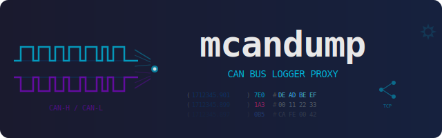
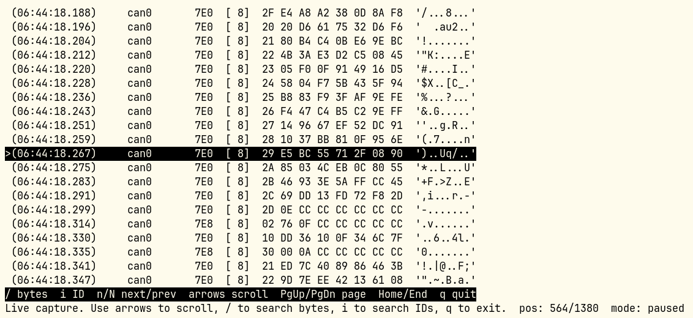

<p align="center">
  
</p>

# mcandump

[](https://github.com/mickeyl/mcandump/actions/workflows/ci.yml)
[](https://github.com/mickeyl/mcandump/actions/workflows/release.yml)
[](LICENSE)
[](https://crates.io/crates/mcandump)


CAN bus logger proxy for Linux, built in Rust. Reads CAN and CAN-FD
frames from a SocketCAN interface, displays them on the terminal (like
`candump`), and simultaneously forwards them to
[CANcorder](https://apps.apple.com/app/cancorder/id6743640770) clients
via the ECUconnect Logger binary protocol over TCP.

## Why?

If you work with CAN bus traffic and want to view it in real time on
your Mac or iPad using CANcorder, you need something that bridges a
Linux SocketCAN interface to the CANcorder logging system. The existing
Python-based logger proxies work, but they add latency, eat CPU, and
can drop frames under high bus load.

**mcandump** is a single-binary Rust replacement that:

- Reads CAN and CAN-FD frames with zero-copy SocketCAN FFI
- Never drops frames — each TCP client gets a dedicated writer thread
  with an unbounded buffer, so a slow client only backs up its own
  queue
- Registers itself via Zeroconf/mDNS so CANcorder discovers it
  automatically
- Displays frames on the terminal with rich color coding — per-ID
  stable colors, heat-mapped data bytes, and aligned ASCII output

## Features

- **CAN and CAN-FD** — classic 8-byte frames and FD frames up to 64
  bytes, with BRS and ESI flag support
- **Zero-drop architecture** — the CAN reader only pushes to unbounded
  channels; a dedicated recorder thread fans out to per-client writer
  threads
- **Zeroconf discovery** — publishes `_ecuconnect-log._tcp.local.` so
  CANcorder finds the logger automatically
- **Rich terminal output** — CAN IDs get a stable per-ID color
  (hash-based palette), data bytes are heat-mapped by value (dim gray
  for 0x00, cyan/green/yellow/red gradient, bold red for 0xFF),
  printable ASCII in green
- **Interactive mode** — alternate-screen terminal UI with unbounded
  in-memory scrollback, cursor/page navigation, and search for payload
  byte sequences or arbitration IDs. Subtle per-column color coding
  keeps the display readable without visual noise. A live tail pane
  appears automatically when you scroll away from the latest frames,
  so you never lose sight of current traffic — resize it on the fly
  with `Shift+↑`/`Shift+↓`
- **Candump-compatible logfile output** — optional background writer
  thread emits the compact `candump` text log format for later replay or
  import into other tools
- **Low-overhead display** — terminal output runs in a `nice(10)`
  thread so it never starves CAN reading, TCP recording, or logfile
  writing
- **Tiny footprint** — ~1.2 MB stripped binary, 4 dependencies



## Requirements

- Linux with SocketCAN support (kernel 2.6.25+)
- Rust toolchain 1.85+
- `CAP_NET_RAW` capability or root for raw CAN sockets

## Building

```bash
make build
```

Or directly with Cargo:

```bash
cargo build --release
```

The binary is at `target/release/mcandump`.

## Installation

### From crates.io

```bash
cargo install mcandump
```

### From source

```bash
git clone https://github.com/mickeyl/mcandump.git
cd mcandump
cargo build --release
# Binary at target/release/mcandump
```

### Pre-built binaries

Download from
[GitHub Releases](https://github.com/mickeyl/mcandump/releases)
(x86_64 and aarch64, glibc and musl).

## Usage

```bash
# Basic usage — display + forward CAN traffic
mcandump can0

# Delta timestamps
mcandump can0 -t delta

# Quiet mode — TCP forwarding only, no terminal output
mcandump can0 -q

# Custom Zeroconf service name
mcandump can0 --service-name "My CAN Logger"

# Disable colors (for piping)
mcandump can0 --no-color

# Interactive scroll/search mode
mcandump can0 --interactive

# Write a candump-compatible log file on disk
mcandump can0 --log-file capture.log

# Let mcandump pick a candump-style default filename
mcandump can0 --log-file
```

### Interactive shortcuts

- `↑` / `↓` — scroll one frame
- `Shift+↑` / `Shift+↓` — resize the live tail pane (visible when
  scrolled away from the latest frames)
- `PgUp` / `PgDn` — scroll one page
- `Home` / `End` — jump to oldest/newest frame
- `/` — find a byte sequence, e.g. `DE AD BE EF` or `deadbeef`
- `i` — find an arbitration ID in hex, e.g. `123` or `0x18FF50E5`
- `n` / `N` — jump to next / previous match
- `q` — exit `mcandump`
- `Esc` — cancel the current search prompt

In interactive mode the capture buffer grows without an internal limit;
it is only bounded by the process memory available on the host.

### Candump Logfiles

Use `--log-file <path>` to write a compact text logfile in the same
style that `candump -L` / `candump -f` produces. If you pass
`--log-file` without a path, `mcandump` generates a default filename in
the current directory using the same style as `candump`, e.g.
`candump-2026-04-02_154530.log`.

```text
(1712345678.901234) can0 123#DEADBEEF
(1712345678.901250) can0 18FF50E5##3112233
```

The logfile writer runs on its own background thread with an unbounded
channel, so slow disk I/O does not block the SocketCAN receive loop.

### All options

| Option | Description | Default |
|---|---|---|
| `-t, --timestamp MODE` | `absolute`, `delta`, or `none` | `absolute` |
| `--no-color` | Disable colored terminal output | off |
| `-q, --quiet` | Suppress terminal display (TCP forwarding only) | off |
| `--interactive` | Interactive terminal UI with scrollback and search | off |
| `-f, --log-file [PATH]` | Write a candump-compatible logfile (auto-named if PATH omitted) | off |
| `--service-name NAME` | Custom Zeroconf service name | auto |

### Makefile targets

Run `make` to see all available targets:

```
build      Build release binary
run        Run with IFACE and EXTRA
test       Quick test on vcan0 (no zeroconf)
vcan       Create vcan0 virtual interface (requires sudo)
vcanfd     Create vcan0 with CAN-FD MTU (requires sudo)
man        View the man page
install    Install binary and man page to PREFIX
uninstall  Remove installed files
fmt        cargo fmt
check      cargo check
clippy     cargo clippy
clean      cargo clean
release    Tag vVERSION, push tag, trigger GitHub release build
publish    Publish to crates.io (dry-run first, 5s to abort)
```

Override the interface: `make run IFACE=vcan0`

### Testing with virtual CAN

```bash
# Set up a virtual CAN interface
sudo modprobe vcan
sudo ip link add dev vcan0 type vcan
sudo ip link set up vcan0

# In one terminal: run mcandump
mcandump vcan0

# In another: generate traffic with mcangen or cangen
mcangen vcan0 -r 100
# or
cangen vcan0
```

## ECUconnect Logger Protocol

Each CAN frame is transmitted as a binary packet over TCP:

```
+-------------+-------------+---------+---------+------------------+
| timestamp   | can_id      | flags   | dlc     | data             |
| 8 bytes     | 4 bytes     | 1 byte  | 1 byte  | 0-64 bytes       |
+-------------+-------------+---------+---------+------------------+
```

- **timestamp**: uint64, big-endian, microseconds since Unix epoch
- **can_id**: uint32, big-endian, CAN arbitration ID
- **flags**: uint8 bitfield — bit0=extended ID, bit1=FD, bit2=BRS,
  bit3=ESI
- **dlc**: uint8, data length (0-8 for CAN, 0-64 for CAN-FD)
- **data**: raw payload bytes

## Threading Model

```
Main thread (default pri) : read CAN socket -> push to recorder + display + log channels
Recorder thread           : recv frames -> pack -> fan out to per-client channels
Per-client writer threads : drain own channel -> write_all to TCP socket
Log writer thread         : drain own channel -> write candump-format logfile
Display thread (nice +10) : drain channel -> format -> print to stdout
TCP server thread         : accept connections -> spawn per-client writers
```

The CAN reader never blocks on slow consumers. Each TCP client has its
own unbounded queue — a slow client only stalls itself.

## Permissions

Reading raw CAN frames requires `CAP_NET_RAW`. Either run as root or
grant the capability to the binary:

```bash
sudo setcap cap_net_raw+ep target/release/mcandump
```

## Man page

```bash
man ./man/mcandump.1
```

## See Also

- [mcangen](https://github.com/mickeyl/mcangen) — high-performance CAN
  frame generator (companion tool for testing)
- [CANcorder](https://apps.apple.com/app/cancorder/id6743640770) — CAN
  bus logger and analyzer for macOS/iOS

## License

[MIT](LICENSE)

## Author

Dr. Michael 'Mickey' Lauer <mickey@vanille-media.de>
